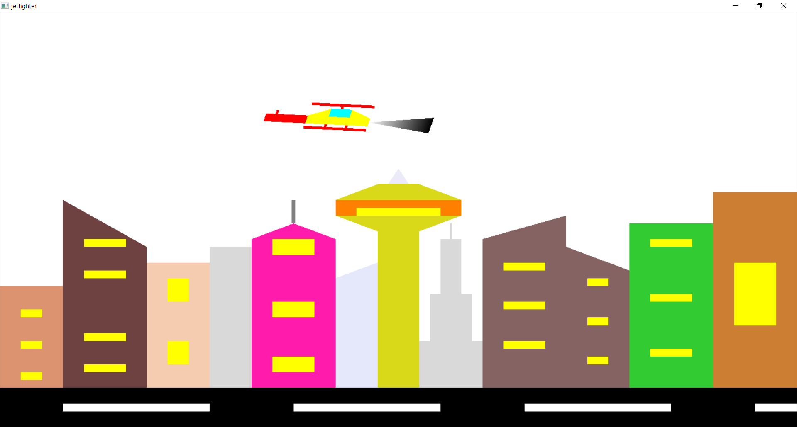
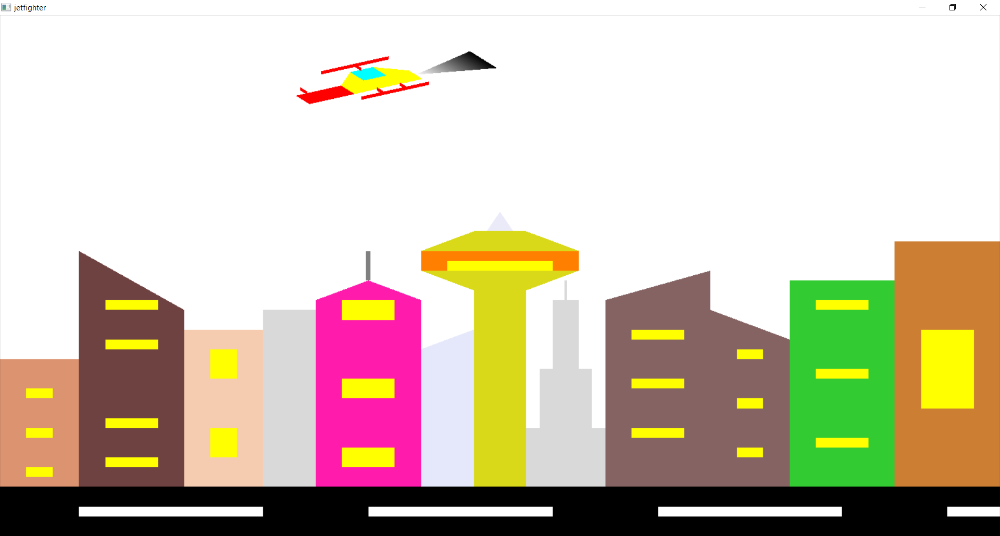
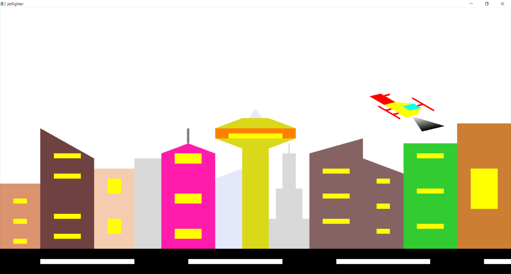
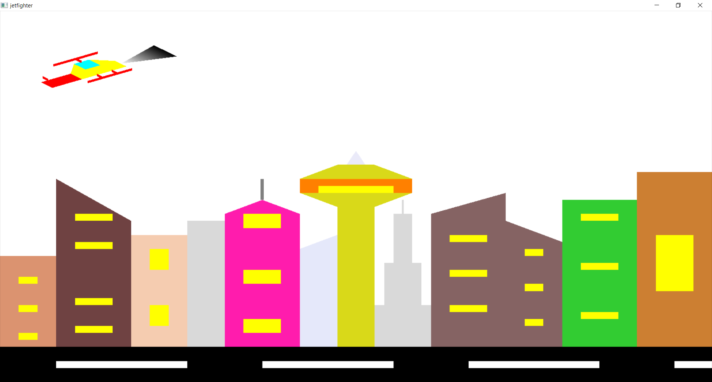

# CG Assignment Fighter Jet Assignment
 CGV Assignment - Siddhanth Tripathi (1BY18CS164)

# Introduction
This project is an animated interactive interface where it simulates the movement of the Helicopter in the war scene and also enables it to shoot the bullets for a specific time. The user can also control the movement of the Helicopter and to shoot the bullets using the keyboard keys such as ‘S’ or space bar to shoot the bullets and up key to increase the speed of the Helicopter and left key to rotate the Helicopter upwards and right key to rotate the Helicopter downwards and by pressing the key ‘p’ to pause the scene and to replay the scene from the same time and the same place from where the Helicopter was freezed .By pressing the key ‘Q’ it quits the scene. It also has a static city background scene. This software makes use of the OpenGL Framework for graphics that are provided and it is coded in C language.

# Screenshots

Output 1

Output 2

Output 3

Output 4

Output 5

# Notes
Implemented using C++ and OpenGL.
